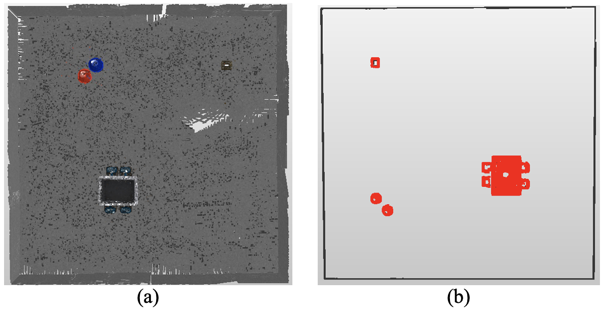

# Object-Triggered 3D SLAM (OTSLAM)

**An efficient, selective 3D mapping framework for Service Robots using ROS 2 (Humble).**

Unlike traditional SLAM which indiscriminately reconstructs the entire environment, **OTSLAM** focuses only on semantically important objects. It uses a 2D LiDAR to trigger detailed RGB-D scans of objects (like chairs and tables) while maintaining a lightweight 2D map for navigation.

▶️ **[Watch the Full Demo Video](https://www.youtube.com/watch?v=AGsYb76OiyI)**

---

## 🚀 What You Can Do With This System

This package provides a complete pipeline for selective mapping and efficient map maintenance.

### 1. Efficient Initial 3D Mapping

Generate high-quality **Hybrid Maps** without the heavy computational cost of full 3D reconstruction.

* **Automatic Object Detection:** The robot autonomously explores the room using 2D LiDAR.
* **Selective Scanning:** When an object (e.g., furniture) is detected, the robot navigates to it and triggers a targeted RGB-D scan.
* **Result:** You get a standard 2D occupancy grid for navigation + high-resolution 3D point clouds **only** for the objects that matter.

### 2. Fast Map Updates (Maintenance)

Keep your map up-to-date without re-scanning the whole room.

* **Change Detection:** The system compares real-time LiDAR data with the saved map.
* **Targeted Updates:** If a chair or table has moved, the system detects the discrepancy and re-scans **only that specific location**.
* **Performance:** Drastically reduces time and data size compared to running a full SLAM session again.

---

## 📊 Performance Highlights

The core advantage of OTSLAM is its ability to filter out redundant background information (walls, floors) and focus on interactable objects.

### Visual Comparison: Traditional vs. OTSLAM

The figure below demonstrates the difference in map quality and storage efficiency.

* **(a) Traditional Dense Mapping:** Reconstructs the entire room indiscriminately, resulting in a noisy map with high memory usage.
* **(b) Proposed OTSLAM:** Selectively reconstructs only targeted objects (highlighted in red), resulting in a clean, semantic-focused map.

<em>Fig 1. Comparison of 3D reconstruction results. (a) Conventional dense mapping vs. (b) Object-Triggered selective mapping.</em>

### Key Metrics

* **Data Reduction:** Reduces map data size by **99.0%** compared to conventional dense 3D mapping.
* **Efficiency:** Significantly faster update times by avoiding global re-scanning.

---

## 🛠️ Prerequisites

* **OS:** Ubuntu 22.04 LTS
* **ROS Distro:** ROS 2 Humble
* **Dependencies:**
* `slam_toolbox`
* `nav2_bringup`
* `turtlebot3_gazebo` & `turtlebot3_navigation2`
* `pcl_ros` (for point cloud processing)

---